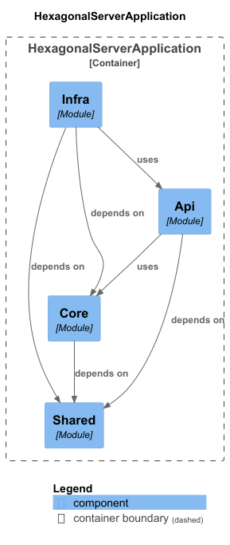

# Hexagonal Architecture Server
### Hexagonal Architecture Server utilizing Modular-Monolith and Clean Architecture Principals

- Java 21
- Maven
- Spring Boot 3.3.0
- PostgeSQL

## Recourses
The resources that aid me in the development of this project.

### Books
#### Get Your Hands Dirty on Clean Architecture: Build 'clean' applications with code examples in Java, Second Edition 
https://www.packtpub.com/en-us/product/get-your-hands-dirty-on-clean-architecture-9781805128373 
#### Clean Architecture: A Craftsman's Guide to Software Structure and Design (Robert C. Martin Series) 1st Edition 
https://www.amazon.com/Clean-Architecture-Craftsmans-Software-Structure/dp/0134494164 

### Hexagonal Architecture
https://blog.mimacom.com/onion-architecture-spring-boot/ 
https://blog.mimacom.com/unit-tests-for-software-architeture/ 
https://herbertograca.com/2017/11/16/explicit-architecture-01-ddd-hexagonal-onion-clean-cqrs-how-i-put-it-all-together/ 
https://wkrzywiec.medium.com/ports-adapters-architecture-on-example-19cab9e93be7 
https://blog.cleancoder.com/uncle-bob/2012/08/13/the-clean-architecture.html 
https://dev.to/peholmst/using-value-objects-with-jpa-27mi 
https://dev.to/kirekov/spring-boot-power-of-value-objects-1oah 

### Integration Testing
https://maciejwalkowiak.com/blog/testcontainers-spring-boot-setup/ 
https://rieckpil.de/spring-boot-integration-tests-with-wiremock-and-junit-5/ 
https://reflectoring.io/spring-boot-testconfiguration/ 